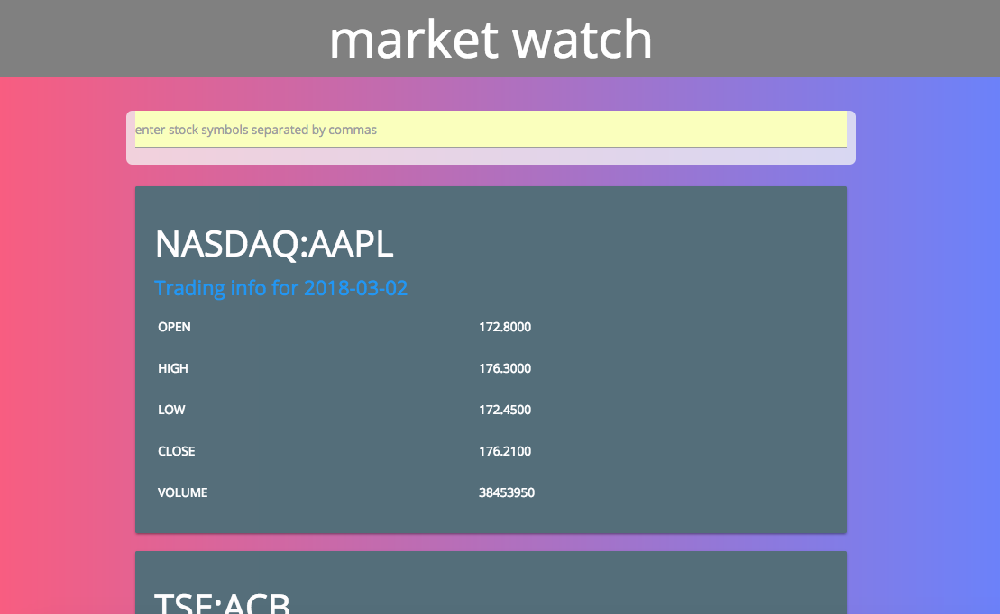
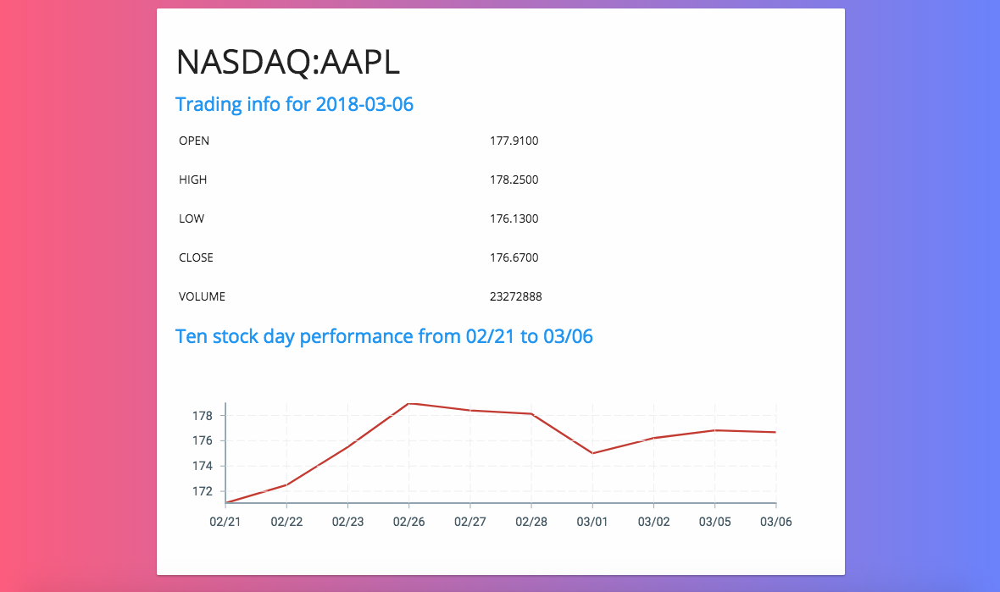

# Market-View
A react application to display stock information.

* Users can enter stock symbols and see information displayed about their stock.

* Users can enter multiple stock symbols separated by commas.

* The app only displays information for the most recent trading day, but it could be configured to display more or less information.

* Check out a deployed demo [here](market-view.surge.sh)

## Installation

Clone this repo. Enter the following commands to run the app:

`npm install`

`npm start`
